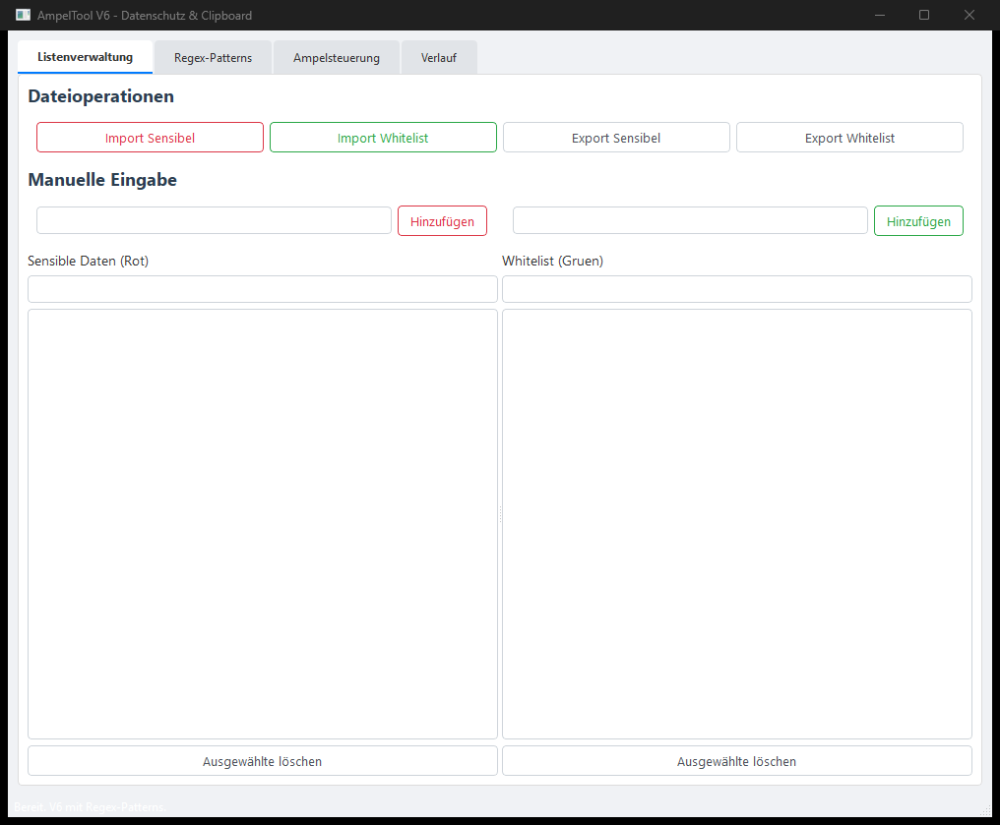
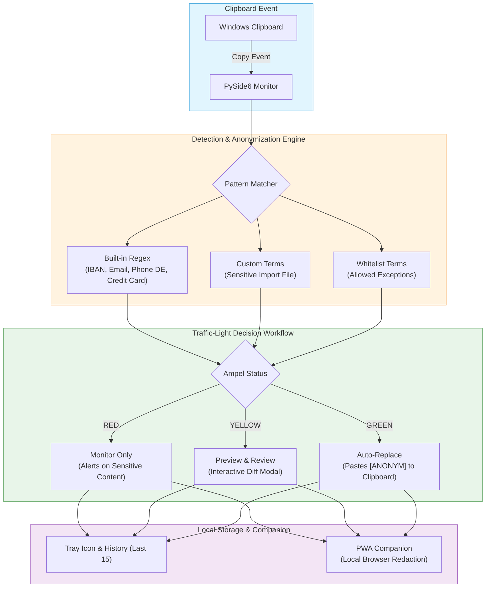

# AmpelClip

**[English](README.md)** | [Deutsch](README_de.md)

[](LICENSE)
[](https://www.python.org/)
[]()
[]()
[]()
[](https://www.qt.io/qt-for-python)
[]()
[](llms.txt)

> Local-first clipboard privacy guard — traffic-light workflow to detect and anonymize sensitive text before you paste it.

AmpelClip is a local-first Windows clipboard privacy monitor. It watches clipboard text, detects sensitive patterns such as IBANs, email addresses, German phone numbers, credit-card-like numbers, postal codes, and dates, and helps anonymize copied content before it is pasted into documents, tickets, chat applications, LLM prompts, or web forms.

> [!NOTE]
> **AI / Agent & Developer Note**: AmpelClip operates 100% offline with zero cloud telemetry. It provides structured regex pattern matching and custom term whitelisting for manual privacy verification. An AI-optimized index is available at [`llms.txt`](llms.txt).



## Architecture & Data Flow



## Start Here

| Need | Use |
|---|---|
| Run the desktop tool | `python Ampel6.py` or `START.bat` |
| Configure detection | Enable built-in regex patterns and import sensitive/whitelist terms |
| Review before replacing | Use yellow preview mode |
| Auto-anonymize clipboard text | Use green mode after checking the rules |
| Run offline PWA companion | Open `web_companion/index.html` in browser |
| Understand limits | Read the manual-review warning below |

## Why AmpelClip

- **Traffic-light workflow**: red for monitor-only, yellow for preview, green for automatic replacement.
- **Clipboard-focused privacy support**: useful before pasting text into documents, tickets, chat tools, LLM prompts or web forms.
- **Built-in pattern detection**: IBAN, email, German phone numbers, credit-card-like numbers, postal codes and dates.
- **Custom lists**: import sensitive terms and whitelist terms from TXT or Excel files.
- **Local-first desktop app**: clipboard handling stays on the local Windows machine.
- **Tray integration and history**: colored tray icon plus the last 15 clipboard entries.
- **Web Companion (PWA)**: offline-first browser companion for manual text redaction and profile exchange.

> [!WARNING]
> AmpelClip is not a complete Data Loss Prevention (DLP) platform and does not guarantee complete redaction. It is a helper for privacy workflows and requires manual verification for critical data.

## Install

Requirements:
- Python 3.10+
- Windows

```bash
git clone https://github.com/file-bricks/AmpelClip.git
cd AmpelClip
pip install -r requirements.txt
python Ampel6.py
```

You can also start the app with `START.bat`.

## How It Works

1. Choose red, yellow or green mode.
2. Enable built-in patterns and optionally import sensitive terms or whitelists.
3. Copy text as usual.
4. AmpelClip checks the clipboard content locally.
5. In yellow mode, review the original and anonymized preview.
6. In green mode, matching sensitive content is replaced with `[ANONYM]`.

## Configuration

Settings are saved in `config.json`, which is created on first start.

| Setting | Description |
|---|---|
| `builtin_patterns` | Enabled and disabled built-in pattern types |
| `ampel_status` | Current traffic-light mode (`red`, `yellow`, `green`) |
| `case_sensitive` | Case-sensitive matching |
| `whole_words` | Whole-word matching only |
| `files` | Previously imported list files |

## Build Executable

```bash
pip install pyinstaller
pyinstaller --onefile --noconsole --icon=ICO.ico --name=AmpelClip Ampel6.py
```

## Search Context

AmpelClip is part of the `file-bricks` local-first desktop tools family. Useful search phrases:

- `AmpelClip clipboard privacy monitor`
- `file-bricks AmpelClip`
- `local-first clipboard privacy tool`
- `Windows clipboard anonymization helper`
- `local clipboard anonymization PySide6`
- `Windows clipboard redaction helper`
- `privacy traffic light clipboard tool`
- `clipboard PII redaction desktop app`
- `PySide6 clipboard privacy utility`

## German README

A full German README is available in [README_de.md](README_de.md).

## License

[MIT License](LICENSE).
