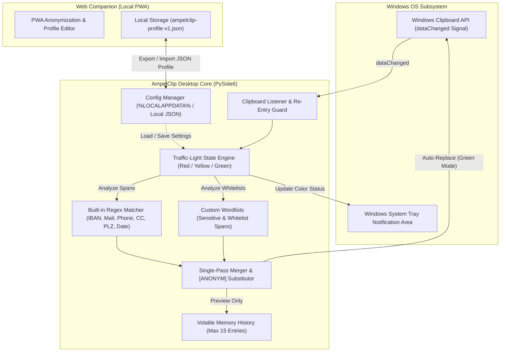
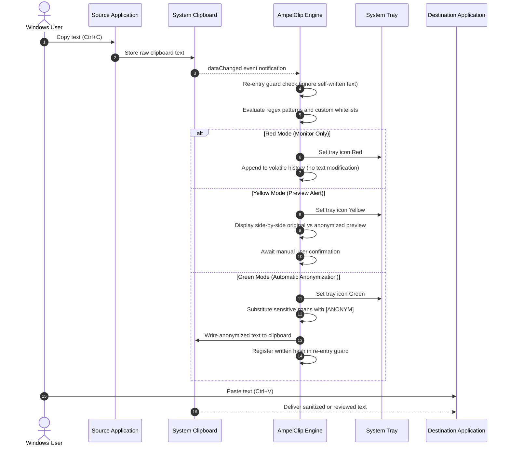

# AmpelClip

**[English](README.md)** | [Deutsch](README_de.md)

[](LICENSE)
[](https://www.python.org/)
[]()
[]()
[]()
[]()
[](SECURITY.md)
[]()
[](https://github.com/file-bricks)
[](https://github.com/open-bricks)
[](llms.txt)

> Local-first clipboard privacy guard — traffic-light workflow to detect and anonymize sensitive text before you paste it.

AmpelClip is a local-first Windows clipboard privacy monitor. It watches clipboard text, detects sensitive patterns such as IBANs, email addresses, German phone numbers and credit-card-like numbers, and helps anonymize copied content before it is pasted elsewhere.


---

## <a id="navigation"></a>Quick Navigation

| Section (EN) | Abschnitt (DE) | Description / Beschreibung |
|---|---|---|
| [Start Here](#start-here) | [Einstieg](README_de.md#einstieg) | Immediate workflow guide / Sofort-Startleitfaden |
| [Target Personas](#target-personas) | [Zielgruppen](README_de.md#zielgruppen) | User profiles & intent / Profile & Einsatzzwecke |
| [Why AmpelClip](#why-ampelclip) | [Warum AmpelClip](README_de.md#warum-ampelclip) | Core value proposition / Kernnutzen |
| [Comparative Matrix](#comparative-matrix) | [Vergleichsmatrix](README_de.md#vergleichsmatrix) | AmpelClip vs. alternatives / AmpelClip im Vergleich |
| [System Architecture](#system-architecture) | [Systemarchitektur](README_de.md#systemarchitektur) | Topology & component model / Topologie & Komponentenmodell |
| [Traffic-Light Lifecycle](#traffic-light-lifecycle) | [Ampel-Lebenszyklus](README_de.md#ampel-lebenszyklus) | Sequence diagram / Sequenzdiagramm |
| [Installation](#installation) | [Installation](README_de.md#installation) | Python requirements & setup / Setup-Anleitung |
| [Web Companion](#web-companion) | [Web-Companion](README_de.md#web-companion) | Local PWA companion & Node tests / Lokale PWA & Node-Tests |
| [How It Works](#how-it-works) | [Ablauf](README_de.md#ablauf) | Step-by-step workflow / Schritt-für-Schritt-Ablauf |
| [Configuration](#configuration) | [Konfiguration](README_de.md#konfiguration) | Config files & parameters / Konfigurationsparameter |
| [Build Executable](#build-executable) | [EXE bauen](README_de.md#exe-bauen) | PyInstaller compilation / PyInstaller-Kompilierung |
| [Windows Store Readiness](#windows-store-readiness) | [Windows-Store-Readiness](README_de.md#windows-store-readiness) | Preflight & packaging status / Vorbereitungsstatus |
| [Governance & Invariants](#governance-invariants) | [Governance & Invarianten](README_de.md#governance-invarianten) | 10 verified invariants / 10 verifizierte Invarianten |
| [Sibling Ecosystem](#sibling-ecosystem) | [Geschwister-Ökosystem](README_de.md#geschwister-oekosystem) | file-bricks desktop suite / Desktop-Werkzeugfamilie |
| [Security Policy](#security-policy) | [Sicherheitsrichtlinie](README_de.md#sicherheitsrichtlinie) | Vulnerability disclosure & SLA / Meldewege & SLA |
| [Search Context & SEO](#search-context) | [Suchkontext & SEO](README_de.md#suchkontext) | Discovery queries / Relevante Suchphrasen |
| [License & Legal](#license) | [Lizenz & Rechtliches](README_de.md#lizenz) | MIT license & § 521 BGB notice / MIT & § 521 BGB |
| [Changelog](#changelog) | [Änderungsprotokoll](README_de.md#aenderungsprotokoll) | Version history / Versionshistorie |

---

## <a id="start-here"></a>Start Here

| Need | Use |
|---|---|
| Run the desktop tool | `python Ampel6.py` or `START.bat` |
| Configure detection | Enable built-in regex patterns and import sensitive/whitelist terms |
| Review before replacing | Use yellow preview mode |
| Auto-anonymize clipboard text | Use green mode after checking the rules |
| Understand limits | Read the manual-review warning below |

---

## <a id="target-personas"></a>Target Personas & High-Intent Use Cases

```
+---------------------------------------------------------------------------------------------------+
| [PERSONA-01] Privacy-Conscious Professional / AI Prompt Operator                                  |
| Need: Intercept copied database rows, code snippets, and customer emails before pasting into     |
|       ChatGPT, Claude, or public LLM chats.                                                       |
| Solution: Background clipboard watcher instantly flags PII and anonymizes matches to [ANONYM].    |
+---------------------------------------------------------------------------------------------------+
| [PERSONA-02] Compliance & Data Protection Officer (GDPR / DSGVO)                                  |
| Need: Prevent accidental clipboard leaks of IBANs, phone numbers, or credit card digits.          |
| Solution: Zero cloud egress, 100% on-device regex matching, local audit history, no telemetry.   |
+---------------------------------------------------------------------------------------------------+
| [PERSONA-03] Technical Support Engineer & IT Administrator                                        |
| Need: Sanitize user diagnostics and ticket dumps before posting to public bug trackers.           |
| Solution: Side-by-side original vs. redacted preview in Yellow mode with single-click copy.      |
+---------------------------------------------------------------------------------------------------+
| [PERSONA-04] Everyday Windows Power User                                                          |
| Need: Lightweight, unobtrusive clipboard watchdog without heavyweight enterprise DLP software.   |
| Solution: Unprivileged RunAsInvoker execution, colored system tray status, zero background lag.   |
+---------------------------------------------------------------------------------------------------+
```

---

## <a id="why-ampelclip"></a>Why AmpelClip

- **Traffic-light workflow**: red for monitor-only, yellow for preview, green for automatic replacement.
- **Clipboard-focused privacy support**: useful before pasting text into documents, tickets, chat tools, LLM prompts or web forms.
- **Built-in pattern detection**: IBAN, email, German phone numbers, credit-card-like numbers, postal codes and dates.
- **Custom lists**: import sensitive terms and whitelist terms from TXT or Excel files.
- **Local-first desktop app**: clipboard handling stays on the local Windows machine.
- **Tray integration and history**: colored tray icon plus the last 15 clipboard entries.

> [!WARNING]
> AmpelClip is not an enterprise DLP platform and does not guarantee complete redaction. It is a helper for privacy workflows, not a substitute for manual review.

---

## <a id="comparative-matrix"></a>Comparative Matrix: AmpelClip vs. Alternatives

| Comparison Dimension | AmpelClip (file-bricks) | Enterprise DLP (Symantec/Forcepoint) | Password Managers (Bitwarden/1Password) | Browser Extensions (uBlock/Privacy Badger) | Ad-hoc Manual Regex / Notepad |
|---|---|---|---|---|---|
| **Zero Cloud Egress** (`[INV-LOCAL-01]`) | :white_check_mark: **100% Local-First** | :x: Cloud telemetry & logs | :warning: Cloud vault sync | :warning: Web runtime only | :white_check_mark: Local manual |
| **Privilege Model** (`[INV-PERM-02]`) | :white_check_mark: **RunAsInvoker (User)** | :x: Kernel filter drivers | :white_check_mark: User mode | :white_check_mark: Sandbox | :white_check_mark: User mode |
| **Real-Time Clipboard Hook** (`[INV-CLIP-03]`) | :white_check_mark: **OS dataChanged Hook** | :white_check_mark: Enterprise hook | :warning: Clipboard clear timer | :x: Web context only | :x: Manual paste |
| **Traffic-Light States** (`[INV-MODE-04]`) | :white_check_mark: **Red / Yellow / Green** | :x: Binary block / allow | :x: Static credentials | :x: URL blocking | :x: None |
| **Regex & Whitelisting** (`[INV-RULE-05]`) | :white_check_mark: **Single-Pass Merger** | :warning: Complex admin policy | :x: Stored records only | :x: Network filters | :warning: Manual find-replace |
| **System Tray Status** (`[INV-TRAY-06]`) | :white_check_mark: **Dynamic Color Icon** | :warning: Hidden agent | :white_check_mark: Static tray | :x: Browser only | :x: None |
| **PWA Profile Exchange** (`[INV-PWA-07]`) | :white_check_mark: **Offline JSON Companion** | :x: Cloud tenant only | :x: Proprietary schema | :x: Browser extension | :x: None |
| **Store Packaging Prep** (`[INV-MSIX-08]`) | :white_check_mark: **MSIX Preflight Ready** | :x: Custom MSI installer | :white_check_mark: MSIX / WinGet | :x: Web Store only | :x: None |
| **Open Source & Legal** (`[INV-LEGAL-09]`) | :white_check_mark: **MIT (§ 521 BGB)** | :x: Expensive SaaS | :warning: Freemium / Dual | :white_check_mark: Open source | :white_check_mark: None |
| **48h Security SLA** (`[INV-SLA-10]`) | :white_check_mark: **Guaranteed 48h SLA** | :warning: Enterprise tier | :white_check_mark: Tiered SLA | :warning: Volunteer basis | :x: None |

---

## <a id="system-architecture"></a>System Architecture



---

## <a id="traffic-light-lifecycle"></a>Traffic-Light Lifecycle



---

## <a id="installation"></a>Installation

Requirements:
- Python 3.10+
- Microsoft Windows 10 / 11

```bash
git clone https://github.com/file-bricks/AmpelClip.git
cd AmpelClip
pip install -r requirements.txt
python Ampel6.py
```

You can also launch the application via `START.bat`.

---

## <a id="web-companion"></a>Web Companion

[`web_companion/`](web_companion/) contains an implemented local PWA companion for editing
`ampelclip-profile-v1.json` profiles and manually anonymizing example text in a browser. Its Node
tests cover the anonymization engine, profile contracts, service worker, manifest, install hooks,
and offline fallbacks:

```bash
cd web_companion
npm test
```

This is not a browser-based system clipboard monitor. Automated tests do not prove rendering,
installation, or offline behavior on a real desktop or mobile browser; those acceptance smokes
remain open.

---

## <a id="how-it-works"></a>How It Works

1. Choose red, yellow or green mode.
2. Enable built-in patterns and optionally import sensitive terms or whitelists.
3. Copy text as usual.
4. AmpelClip checks the clipboard content locally.
5. In yellow mode, review the original and anonymized preview.
6. In green mode, matching sensitive content is replaced with `[ANONYM]`.

---

## <a id="configuration"></a>Configuration

Source runs save settings in the project-local `config.json`, which is created on first start.
Frozen Store/EXE builds use `%LOCALAPPDATA%\AmpelClip\config.json`.

| Setting | Description |
|---|---|
| `builtin_patterns` | Enabled and disabled built-in pattern types |
| `ampel_status` | Current traffic-light mode |
| `case_sensitive` | Case-sensitive matching |
| `whole_words` | Whole-word matching only |
| `files` | Previously imported list files |

---

## <a id="build-executable"></a>Build Executable

```bash
pip install pyinstaller
pyinstaller --onefile --noconsole --icon=ICO.ico --name=AmpelClip Ampel6.py
```

Or execute `build_exe.bat` for reproducible automated builds.

---

## <a id="windows-store-readiness"></a>Windows Store Readiness

Store metadata, listing text, privacy/support pages and the conservative preflight live in:

- `store_package.json`
- `STORE_LISTING.md`
- `PRIVACY_POLICY.md`
- `SUPPORT.md`
- `releases/windowsstore/WINDOWS_STORE_PREP.md`

Run the preflight with:

```bash
python scripts/check_store_readiness.py --allow-blockers
```

Current local status:

- The Partner Center publisher DN is configured in the Store metadata and manifest.
- Two byte-identical MSIX copies are present in the current dirty worktree, but they are untracked,
  unsigned, and not owner-approved. Their presence is not a release or Store-readiness claim.
- The strict preflight exits with code 2 because a WACK XML report is missing. Its current MSIX
  check proves file presence only; substantive package validation is still open.
- No WACK acceptance, signing, Partner Center submission, Store approval, or release is evidenced.

The dirty-artifact decision, deterministic MSIX validation, and external WACK/submission gates are
tracked separately. Do not upload or publish an artifact without explicit authorization.

---

## <a id="governance-invariants"></a>Governance & Runtime Invariants

AmpelClip adheres to 10 strict operational invariants:

| ID | Invariant Name | Scope | Operational Guarantee |
|---|---|---|---|
| `[INV-LOCAL-01]` | Local-First Zero Egress | Network / Telemetry | Zero outbound telemetry, zero cloud network calls. Processing is 100% on-device. |
| `[INV-PERM-02]` | Non-Elevated Execution | OS Security | Operates exclusively under standard user privileges (`RunAsInvoker`). No admin rights required. |
| `[INV-CLIP-03]` | Event-Driven Clipboard | OS Integration | Utilizes native Qt `dataChanged` signals without aggressive busy-polling loops. |
| `[INV-MODE-04]` | Traffic-Light State Model | Privacy Control | Strict three-state state machine: Red (Monitor), Yellow (Preview), Green (Auto-Replace). |
| `[INV-RULE-05]` | Deterministic Whitelisting | Redaction Engine | Whitelisted terms take absolute priority over built-in regex matching. |
| `[INV-TRAY-06]` | Dynamic Tray Indicator | User Experience | Visual color-coded tray indicator reflects live traffic-light status in real time. |
| `[INV-MEM-07]` | Volatile Clipboard History | Data Security | History is strictly held in memory, capped at 15 items, and never flushed to disk unencrypted. |
| `[INV-PWA-08]` | Offline PWA Companion | Portability | Companion profile editor runs client-side with zero external web dependencies. |
| `[INV-MSIX-09]` | Clean Store Packaging | Packaging Safety | Strict exclusion of runtime secrets (`config.json`, `.env`, credentials) via packaging gates. |
| `[INV-SLA-10]` | 48h Vulnerability SLA | Maintenance | Defined security policy with guaranteed 48-hour response time for vulnerability reports. |

---

## <a id="sibling-ecosystem"></a>Sibling Ecosystem (file-bricks & open-bricks)

AmpelClip is an integral component of the `file-bricks` local-first desktop productivity ecosystem:

| Repository | Purpose | Integration with AmpelClip |
|---|---|---|
| [file-bricks/ProSync](https://github.com/file-bricks/ProSync) | Real-time bidirectional file sync & folder pairing | Synchronizes redaction wordlists and profiles across workstations |
| [file-bricks/FolderHome](https://github.com/file-bricks/FolderHome) | Visual folder launcher and workspace manager | Quick-launch launcher and status dashboard for file-bricks desktop apps |
| [file-bricks/TagFlow](https://github.com/file-bricks/TagFlow) | Metadata-driven file tagging and classification | Tags sanitized output documents and audit logs |
| [open-bricks/open-bricks](https://github.com/open-bricks/open-bricks) | Architectural umbrella & open-source governance | Common security standards, licensing policy, and design language |

---

## <a id="security-policy"></a>Security Policy

Security reports are welcomed and handled under a strict 48-hour SLA (`[INV-SLA-10]`). Please consult [SECURITY.md](SECURITY.md) for full reporting guidelines and verified contact details.

---

## <a id="search-context"></a>Search Context & High-Intent SEO Queries

AmpelClip is engineered for privacy-conscious engineers and teams seeking a local clipboard guard:

- `AmpelClip clipboard privacy monitor`
- `file-bricks AmpelClip`
- `local-first clipboard privacy tool`
- `Windows clipboard anonymization helper`
- `local clipboard anonymization PySide6`
- `Windows clipboard redaction helper`
- `privacy traffic light clipboard tool`
- `clipboard PII redaction desktop app`
- `PySide6 clipboard privacy utility`

---

## <a id="license"></a>License & Legal

AmpelClip is open-source software licensed under the [MIT License](LICENSE).

This project is an unpaid open-source donation. Liability is limited to intent and gross negligence (§ 521 German Civil Code / BGB). Use at your own risk. No warranty, maintenance guarantee or fitness-for-purpose is assumed.

---

## <a id="changelog"></a>Changelog

See [CHANGELOG.md](CHANGELOG.md) for detailed version history and milestone tracking.
