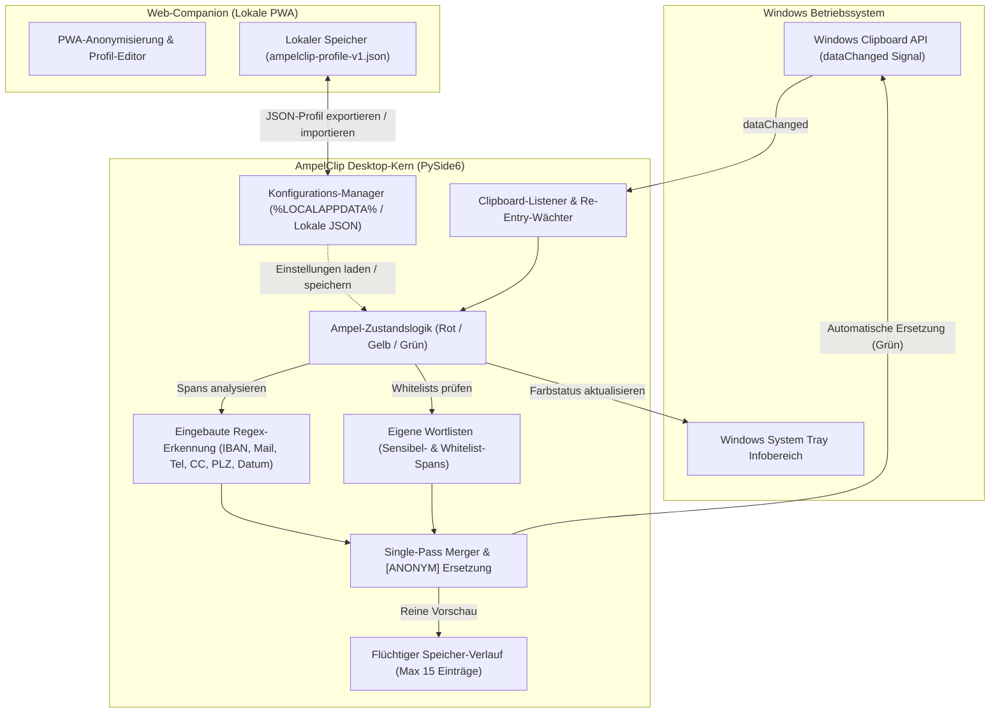
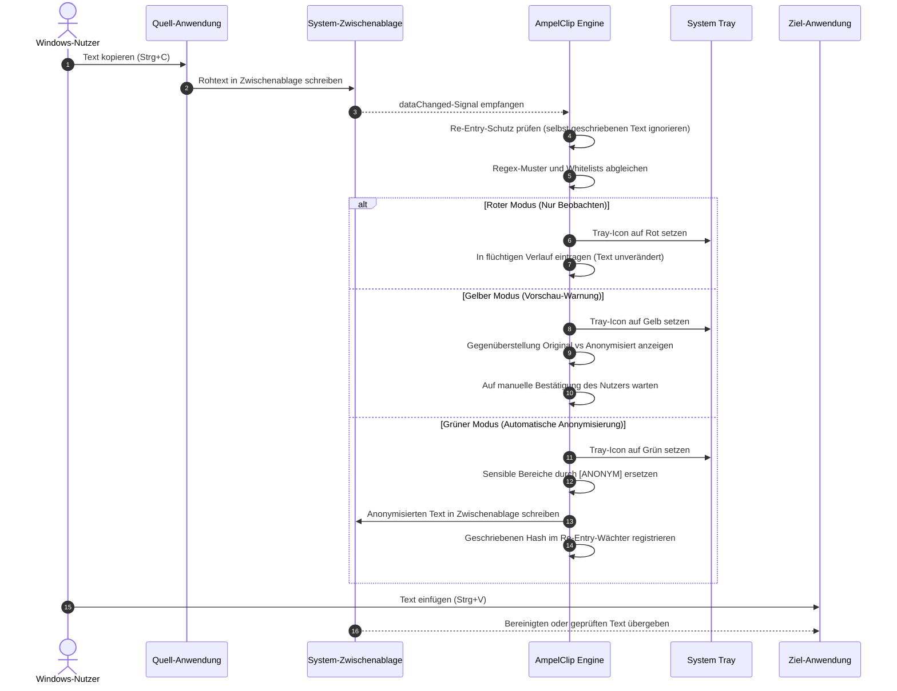

# AmpelClip

[English](README.md) | **[Deutsch](README_de.md)**

[](LICENSE)
[](https://www.python.org/)
[]()
[]()
[]()
[]()
[](SECURITY.md)
[]()
[](https://github.com/file-bricks)
[](https://github.com/open-bricks)
[](llms.txt)

> Lokaler Zwischenablage-Datenschutzwächter — Ampel-Workflow zum Erkennen und Anonymisieren sensibler Texte vor dem Einfügen.

AmpelClip ist ein lokales Windows-Tool zur Datenschutz-Unterstützung in der Zwischenablage. Es erkennt sensible Daten wie IBANs, E-Mail-Adressen, deutsche Telefonnummern, kreditkartenähnliche Zahlen, Postleitzahlen und Datumsangaben in kopiertem Text und hilft, diese Inhalte vor dem Einfügen zu anonymisieren.


---

## <a id="navigation"></a>Schnellnavigation

| Abschnitt (DE) | Section (EN) | Beschreibung / Description |
|---|---|---|
| [Einstieg](#einstieg) | [Start Here](README.md#start-here) | Sofort-Startleitfaden / Immediate workflow guide |
| [Zielgruppen](#zielgruppen) | [Target Personas](README.md#target-personas) | Profile & Einsatzzwecke / User profiles & intent |
| [Warum AmpelClip](#warum-ampelclip) | [Why AmpelClip](README.md#why-ampelclip) | Kernnutzen & Mehrwert / Core value proposition |
| [Vergleichsmatrix](#vergleichsmatrix) | [Comparative Matrix](README.md#comparative-matrix) | AmpelClip im Vergleich / AmpelClip vs. alternatives |
| [Systemarchitektur](#systemarchitektur) | [System Architecture](README.md#system-architecture) | Topologie & Komponentenmodell / Topology & component model |
| [Ampel-Lebenszyklus](#ampel-lebenszyklus) | [Traffic-Light Lifecycle](README.md#traffic-light-lifecycle) | Sequenzdiagramm / Sequence diagram |
| [Installation](#installation) | [Installation](README.md#installation) | Python-Voraussetzungen & Setup / Python setup guide |
| [Web-Companion](#web-companion) | [Web Companion](README.md#web-companion) | Lokale PWA & Node-Tests / Local PWA companion & tests |
| [Ablauf](#ablauf) | [How It Works](README.md#how-it-works) | Schritt-für-Schritt-Ablauf / Step-by-step workflow |
| [Konfiguration](#konfiguration) | [Configuration](README.md#configuration) | Einstellungsdateien & Parameter / Config files & parameters |
| [EXE bauen](#exe-bauen) | [Build Executable](README.md#build-executable) | PyInstaller-Kompilierung / PyInstaller compilation |
| [Windows-Store-Readiness](#windows-store-readiness) | [Windows Store Readiness](README.md#windows-store-readiness) | Vorbereitungsstatus & Preflight / Packaging & preflight status |
| [Governance & Invarianten](#governance-invarianten) | [Governance & Invariants](README.md#governance-invariants) | 10 verifizierte Invarianten / 10 verified invariants |
| [Geschwister-Ökosystem](#geschwister-oekosystem) | [Sibling Ecosystem](README.md#sibling-ecosystem) | file-bricks Desktop-Werkzeugfamilie / Desktop tool family |
| [Sicherheitsrichtlinie](#sicherheitsrichtlinie) | [Security Policy](README.md#security-policy) | Meldewege & Reaktions-SLA / Vulnerability disclosure & SLA |
| [Suchkontext & SEO](#suchkontext) | [Search Context & SEO](README.md#search-context) | Relevante Suchbegriffe / Discovery queries |
| [Lizenz & Rechtliches](#lizenz) | [License & Legal](README.md#license) | MIT-Lizenz & § 521 BGB Hinweis / MIT & § 521 BGB notice |
| [Änderungsprotokoll](#aenderungsprotokoll) | [Changelog](README.md#changelog) | Versionshistorie / Version history |

---

## <a id="start-here"></a><a id="einstieg"></a>Einstieg

| Bedarf | Nutzung |
|---|---|
| Desktop-Tool starten | `python Ampel6.py` oder `START.bat` |
| Erkennungsregeln konfigurieren | Eingebaute Regex-Muster aktivieren und Sensibel-/Whitelist-Begriffe importieren |
| Vor dem Ersetzen prüfen | Gelben Vorschau-Modus nutzen |
| Zwischenablage automatisch anonymisieren | Grünen Modus erst nach Regelprüfung nutzen |
| Grenzen verstehen | Warnhinweis zur manuellen Nachkontrolle lesen |

---

## <a id="target-personas"></a><a id="zielgruppen"></a>Zielgruppen & Praxis-Einsatzzwecke

```
+---------------------------------------------------------------------------------------------------+
| [PERSONA-01] Datenschutzbewusster Entwickler & KI-Prompt-Operator                                 |
| Bedarf: Verhindern, dass Datenbankabfragen, Code-Snippets oder Kundendaten versehentlich in       |
|         ChatGPT, Claude oder öffentliche LLMs eingefügt werden.                                   |
| Lösung: Hintergrund-Wächter erkennt personenbezogene Daten sofort und maskiert zu [ANONYM].       |
+---------------------------------------------------------------------------------------------------+
| [PERSONA-02] Compliance-, Rechts- und Datenschutzbeauftragter (DSGVO / GDPR)                      |
| Bedarf: Unterbindung unbedachter Zwischenablage-Exfiltrationen von IBANs, Telefonnummern etc.     |
| Lösung: Vollständige On-Device-Verarbeitung ohne Cloud-Verbindung, lokale Verlaufsanzeige.        |
+---------------------------------------------------------------------------------------------------+
| [PERSONA-03] Helpdesk- und Support-Mitarbeiter                                                    |
| Bedarf: Schnelles Bereinigen von Kunden-Fehlermeldungen vor dem Posten in Issue-Trackern.          |
| Lösung: Gelber Vorschau-Modus mit direkter Gegenüberstellung von Original und bereinigtem Text.   |
+---------------------------------------------------------------------------------------------------+
| [PERSONA-04] Windows-Power-User                                                                   |
| Bedarf: Schlanker, unaufdringlicher Zwischenablage-Schutz ohne träge Enterprise-DLP-Agenten.      |
| Lösung: Unprivilegierte Ausführung (RunAsInvoker), farbige Tray-Statusanzeige, minimale Last.     |
+---------------------------------------------------------------------------------------------------+
```

---

## <a id="why-ampelclip"></a><a id="warum-ampelclip"></a>Warum AmpelClip

- **Ampel-Workflow**: Rot für reines Beobachten, Gelb für Vorschau, Grün für automatische Ersetzung.
- **Zwischenablage-Fokus**: hilfreich vor dem Einfügen in Dokumente, Tickets, Chat-Tools, LLM-Prompts oder Webformulare.
- **Eingebaute Muster**: IBAN, E-Mail, deutsche Telefonnummern, kreditkartenähnliche Zahlen, Postleitzahlen und Datumsangaben.
- **Eigene Listen**: Sensibel-Liste und Whitelist können aus TXT- oder Excel-Dateien importiert werden.
- **Lokal zuerst**: Die Zwischenablage wird auf dem lokalen Windows-Rechner verarbeitet.
- **Tray und Verlauf**: Farbiges System-Tray-Icon plus die letzten 15 Zwischenablage-Einträge.

> [!WARNING]
> AmpelClip ist keine Enterprise-DLP-Plattform und garantiert keine vollständige Schwärzung oder Anonymisierung. Es unterstützt Datenschutz-Workflows, ersetzt aber keine manuelle Prüfung.

---

## <a id="comparative-matrix"></a><a id="vergleichsmatrix"></a>Vergleichsmatrix: AmpelClip vs. Alternativen

| Vergleichsdimension | AmpelClip (file-bricks) | Enterprise-DLP (Symantec/Forcepoint) | Passwort-Manager (Bitwarden/1Password) | Browser-Erweiterungen (uBlock/Privacy Badger) | Manuelles Suchen/Ersetzen (Notepad) |
|---|---|---|---|---|---|
| **Vollständig lokale Ausführung** (`[INV-LOCAL-01]`) | :white_check_mark: **100% lokal** | :x: Cloud-Telemetrie & Logs | :warning: Cloud-Tresor-Sync | :warning: Nur im Webbrowser | :white_check_mark: Manuell lokal |
| **Berechtigungsmodell** (`[INV-PERM-02]`) | :white_check_mark: **RunAsInvoker (Benutzer)** | :x: Kernel-Treiber / Admin | :white_check_mark: Standard-Benutzer | :white_check_mark: Browser-Sandbox | :white_check_mark: Standard-Benutzer |
| **Echtzeit-Zwischenablage-Hook** (`[INV-CLIP-03]`) | :white_check_mark: **OS dataChanged-Signal** | :white_check_mark: Enterprise-Hook | :warning: Zwischenablage-Timer | :x: Kein OS-Hook | :x: Nur manuelle Aktion |
| **Ampel-Zustandsmodell** (`[INV-MODE-04]`) | :white_check_mark: **Rot / Gelb / Grün** | :x: Nur Blockieren / Erlauben | :x: Feste Zugangsdaten | :x: URL-Filterung | :x: Keine |
| **Regex & Whitelisting** (`[INV-RULE-05]`) | :white_check_mark: **Single-Pass-Merger** | :warning: Komplexe Admin-Policy | :x: Nur gespeicherte Einträge | :x: Netzwerkfilter | :warning: Manuell fehleranfällig |
| **System-Tray-Farbstatus** (`[INV-TRAY-06]`) | :white_check_mark: **Dynamisches Farbiccon** | :warning: Versteckter Agent | :white_check_mark: Statisches Icon | :x: Nur Browser-UI | :x: Kein Tray |
| **PWA-Profil-Austausch** (`[INV-PWA-07]`) | :white_check_mark: **Offline-JSON-Companion** | :x: Nur zentraler Server | :x: Proprietäres Schema | :x: Browser-Erweiterung | :x: Keine |
| **Store-Packaging-Bereitschaft** (`[INV-MSIX-08]`) | :white_check_mark: **MSIX-Preflight bereit** | :x: Proprietäre MSI-Pakete | :white_check_mark: MSIX / WinGet | :x: Nur Web-Store | :x: Keine |
| **Open Source & Haftung** (`[INV-LEGAL-09]`) | :white_check_mark: **MIT (§ 521 BGB)** | :x: Teure SaaS-Lizenzen | :warning: Freemium / Dual | :white_check_mark: Open Source | :white_check_mark: Keine |
| **48h Sicherheits-SLA** (`[INV-SLA-10]`) | :white_check_mark: **Garantierte 48h SLA** | :warning: Support-Ticket | :white_check_mark: Gestaffelte SLA | :warning: Freiwilligenbasis | :x: Keine |

---

## <a id="system-architecture"></a><a id="systemarchitektur"></a>Systemarchitektur



---

## <a id="traffic-light-lifecycle"></a><a id="ampel-lebenszyklus"></a>Ampel-Lebenszyklus



---

## <a id="installation"></a>Installation

Voraussetzungen:
- Python 3.10+
- Microsoft Windows 10 / 11

```bash
git clone https://github.com/file-bricks/AmpelClip.git
cd AmpelClip
pip install -r requirements.txt
python Ampel6.py
```

Alternativ kann die Anwendung über `START.bat` gestartet werden.

---

## <a id="web-companion"></a>Web-Companion

[`web_companion/`](web_companion/) enthält einen implementierten lokalen PWA-Companion zum
Bearbeiten von `ampelclip-profile-v1.json`-Profilen und zur manuellen Anonymisierung von
Beispieltexten im Browser. Die Node-Tests prüfen Anonymisierungslogik, Profilverträge, Service
Worker, Manifest, Installations-Hooks und Offline-Fallbacks:

```bash
cd web_companion
npm test
```

Der Companion ist kein browserbasierter System-Clipboard-Monitor. Automatisierte Tests belegen
weder Darstellung, Installation noch Offline-Verhalten auf einem realen Desktop- oder
Mobilbrowser; diese Abnahmen stehen weiterhin aus.

---

## <a id="how-it-works"></a><a id="ablauf"></a>Ablauf

1. Roten, gelben oder grünen Modus wählen.
2. Eingebaute Muster aktivieren und optional Sensibel- oder Whitelist-Begriffe importieren.
3. Text wie gewohnt kopieren.
4. AmpelClip prüft den Inhalt der Zwischenablage lokal.
5. Im gelben Modus Original und anonymisierte Vorschau prüfen.
6. Im grünen Modus werden passende sensible Inhalte durch `[ANONYM]` ersetzt.

---

## <a id="configuration"></a><a id="konfiguration"></a>Konfiguration

Source-Starts speichern Einstellungen in der projektlokalen `config.json`, die beim ersten Start automatisch entsteht.
Frozen Store-/EXE-Builds nutzen `%LOCALAPPDATA%\AmpelClip\config.json`.

| Einstellung | Bedeutung |
|---|---|
| `builtin_patterns` | Aktivierte und deaktivierte eingebaute Mustertypen |
| `ampel_status` | Aktueller Ampel-Modus |
| `case_sensitive` | Groß-/Kleinschreibung beachten |
| `whole_words` | Nur ganze Wörter ersetzen |
| `files` | Zuletzt importierte Listendateien |

---

## <a id="build-executable"></a><a id="exe-bauen"></a>EXE bauen

```bash
pip install pyinstaller
pyinstaller --onefile --noconsole --icon=ICO.ico --name=AmpelClip Ampel6.py
```

Oder `build_exe.bat` für reproduzierbare automatisierte Builds ausführen.

---

## <a id="windows-store-readiness"></a>Windows-Store-Readiness

Store-Metadaten, Listingtext, Datenschutz-/Supportseiten und der konservative Preflight liegen in:

- `store_package.json`
- `STORE_LISTING.md`
- `PRIVACY_POLICY.md`
- `SUPPORT.md`
- `releases/windowsstore/WINDOWS_STORE_PREP.md`

Preflight ausführen:

```bash
python scripts/check_store_readiness.py --allow-blockers
```

Aktueller lokaler Stand:

- Der Partner-Center-Publisher-DN ist in Store-Metadaten und Manifest gesetzt.
- Im aktuellen Dirty Worktree liegen zwei bytegleiche MSIX-Kopien. Sie sind unversioniert,
  unsigniert und nicht durch den Eigentümer freigegeben; ihre bloße Existenz ist kein Release-
  oder Store-Readiness-Nachweis.
- Der strikte Preflight endet mit Exitcode 2, weil ein WACK-XML-Report fehlt. Die derzeitige
  MSIX-Prüfung belegt nur die Dateipräsenz; eine inhaltliche Paketvalidierung steht noch aus.
- WACK-Abnahme, Signierung, Partner-Center-Einreichung, Store-Freigabe und Release sind nicht
  nachgewiesen.

Eigentümerentscheidung zum Dirty Slice, deterministische MSIX-Prüfung und externe
WACK-/Einreichungsgates werden getrennt verfolgt. Ohne ausdrückliche Autorisierung darf kein
Artefakt hochgeladen oder veröffentlicht werden.

---

## <a id="governance-invariants"></a><a id="governance-invarianten"></a>Governance & Invarianten

AmpelClip unterliegt 10 verbindlichen Betriebsinvarianten:

| ID | Invarianten-Bezeichnung | Bereich | Garantierte Eigenschaft |
|---|---|---|---|
| `[INV-LOCAL-01]` | Lokale Ausführung & Zero-Egress | Netzwerk / Telemetrie | Keine Telemetrie, keine externen Netzwerkaufrufe. Vollständige On-Device-Verarbeitung. |
| `[INV-PERM-02]` | Unprivilegierte Ausführung | Betriebssystemsicherheit | Läuft vollständig im Benutzerkontext (`RunAsInvoker`). Keine Administratorrechte erforderlich. |
| `[INV-CLIP-03]` | Ereignisgesteuerter Hook | OS-Integration | Nutzt native Qt `dataChanged`-Signale ohne blockierende Busy-Loop-Pollingzyklen. |
| `[INV-MODE-04]` | Dreistufiges Ampelmodell | Datenschutzsteuerung | Striktes Zustandsmodell: Rot (Beobachten), Gelb (Vorschau), Grün (Automatisches Ersetzen). |
| `[INV-RULE-05]` | Deterministisches Whitelisting | Redaktionslogik | Freigegebene Whitelist-Begriffe haben absolute Priorität vor Regex-Mustern. |
| `[INV-TRAY-06]` | Dynamischer Farb-Trayindikator | Benutzererlebnis | Farbcodiertes Infobereichssymbol spiegelt den aktuellen Ampel-Status in Echtzeit wider. |
| `[INV-MEM-07]` | Flüchtiger Zwischenablageverlauf | Datensicherheit | Der Verlauf ist auf 15 Einträge begrenzt, liegt rein im RAM und wird nie unverschlüsselt gesichert. |
| `[INV-PWA-08]` | Offline-PWA-Companion | Portabilität | Der Begleiter-Editor läuft autark im Browser ohne externe Web-Abhängigkeiten. |
| `[INV-MSIX-09]` | Sauberes Store-Packaging | Paketsicherheit | Ausschluss vertraulicher Laufzeitdaten (`config.json`, `.env`, Tokens) vor der Bündelung. |
| `[INV-SLA-10]` | 48h Sicherheits-Reaktions-SLA | Projektpflege | Verbindliche Sicherheitsrichtlinie mit Erstreaktion innerhalb von 48 Stunden. |

---

## <a id="sibling-ecosystem"></a><a id="geschwister-oekosystem"></a>Geschwister-Ökosystem (file-bricks & open-bricks)

AmpelClip ist fester Bestandteil der `file-bricks` Werkzeugfamilie für lokale Desktop-Produktivität:

| Repository | Zweck | Zusammenspiel mit AmpelClip |
|---|---|---|
| [file-bricks/ProSync](https://github.com/file-bricks/ProSync) | Bidirektionale Dateisynchronisation & Ordnerspiegelung | Gleicht Redaktionslisten und bereinigte Profile zwischen Arbeitsplätzen ab |
| [file-bricks/FolderHome](https://github.com/file-bricks/FolderHome) | Visueller Ordner-Starter & Workspace-Manager | Schnellstartleiste und Statusanzeige für file-bricks Desktop-Werkzeuge |
| [file-bricks/TagFlow](https://github.com/file-bricks/TagFlow) | Schlagwortbasierte Dateiverwaltung & Verschlagwortung | Organisiert anonymisierte Exportdokumente und Prüfprotokolle |
| [open-bricks/open-bricks](https://github.com/open-bricks/open-bricks) | Dachverband & Open-Source-Governance | Gemeinsame Standards für Lizenzierung, Sicherheit und UI-Gestaltung |

---

## <a id="security-policy"></a><a id="sicherheitsrichtlinie"></a>Sicherheitsrichtlinie

Sicherheitsmeldungen werden unter einer garantierten 48-Stunden-Reaktions-SLA (`[INV-SLA-10]`) bearbeitet. Bitte konsultieren Sie [SECURITY.md](SECURITY.md) für Meldevorgaben und Kontaktadressen.

---

## <a id="search-context"></a><a id="suchkontext"></a>Suchkontext & SEO

AmpelClip richtet sich an datenschutzbewusste Entwickler und Teams, die einen lokalen Zwischenablage-Schutz suchen:

- `AmpelClip Zwischenablage Datenschutz`
- `file-bricks AmpelClip`
- `lokale Zwischenablage anonymisieren`
- `Windows Clipboard Redaction Tool`
- `PySide6 Datenschutz Zwischenablage`
- `Clipboard PII Redaction Desktop App`
- `offline clipboard privacy guard`
- `Windows Zwischenablage PII schwärzen`

---

## <a id="license"></a><a id="lizenz"></a>Lizenz & Rechtliches

AmpelClip ist freie Open-Source-Software unter der [MIT-Lizenz](LICENSE).

Dieses Projekt ist eine unentgeltliche Open-Source-Spende. Die Haftung ist auf Vorsatz und grobe Fahrlässigkeit beschränkt (§ 521 BGB). Nutzung auf eigenes Risiko. Es gibt keine Garantie, Wartungszusage oder Zusicherung einer bestimmten Eignung.

---

## <a id="changelog"></a><a id="aenderungsprotokoll"></a>Änderungsprotokoll

Detaillierte Versionsverläufe und Meilensteine finden Sie in [CHANGELOG.md](CHANGELOG.md).
