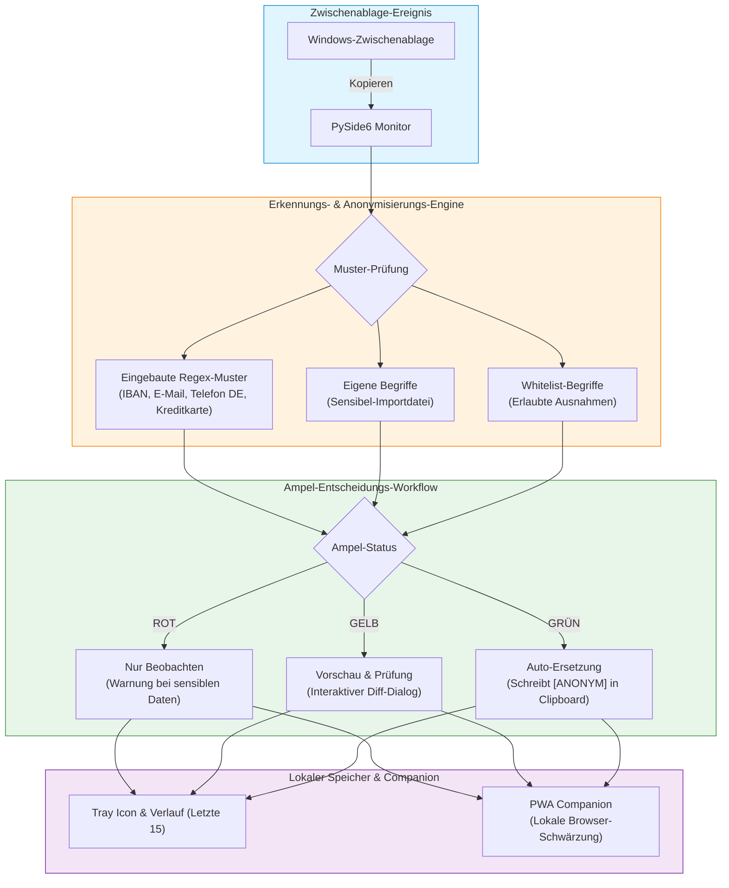

# AmpelClip

[English](README.md) | **[Deutsch](README_de.md)**

[](https://github.com/file-bricks)
[](https://github.com/open-bricks)
[](LICENSE)
[](https://www.python.org/)
[]()
[]()
[]()
[](https://www.qt.io/qt-for-python)
[]()
[](llms.txt)

> Lokaler Zwischenablage-Datenschutzwächter — Ampel-Workflow zum Erkennen und Anonymisieren sensibler Texte vor dem Einfügen.

AmpelClip ist ein lokales Windows-Tool zur Datenschutz-Unterstützung in der Zwischenablage. Es erkennt sensible Daten wie IBANs, E-Mail-Adressen, deutsche Telefonnummern, kreditkartenähnliche Zahlen, Postleitzahlen und Datumsangaben in kopiertem Text und hilft, diese Inhalte vor dem Einfügen in Dokumente, Tickets, Chat-Tools, LLM-Prompts oder Webformulare zu anonymisieren.

> [!NOTE]
> **KI / Agenten & Entwickler-Hinweis**: AmpelClip arbeitet zu 100 % offline ohne Cloud-Telemetrie. Es bietet strukturierte Regex-Mustererkennung und benutzerdefinierte Begriffs-Whitelists zur manuellen Datenschutz-Verifikation. Eine KI-optimierte Übersicht befindet sich unter [`llms.txt`](llms.txt).


## Architektur & Datenfluss



## Einstieg

| Bedarf | Nutzung |
|---|---|
| Desktop-Tool starten | `python Ampel6.py` oder `START.bat` |
| Erkennungsregeln konfigurieren | Eingebaute Regex-Muster aktivieren und Sensibel-/Whitelist-Begriffe importieren |
| Vor dem Ersetzen prüfen | Gelben Vorschau-Modus nutzen |
| Zwischenablage automatisch anonymisieren | Grünen Modus erst nach Regelprüfung nutzen |
| Offline PWA-Companion nutzen | `web_companion/index.html` im Browser öffnen |
| Grenzen verstehen | Warnhinweis zur manuellen Nachkontrolle lesen |

## Warum AmpelClip

- **Ampel-Workflow**: Rot für reines Beobachten, Gelb für Vorschau, Grün für automatische Ersetzung.
- **Zwischenablage-Fokus**: hilfreich vor dem Einfügen in Dokumente, Tickets, Chat-Tools, LLM-Prompts oder Webformulare.
- **Eingebaute Muster**: IBAN, E-Mail, deutsche Telefonnummern, kreditkartenähnliche Zahlen, Postleitzahlen und Datumsangaben.
- **Eigene Listen**: Sensibel-Liste und Whitelist können aus TXT- oder Excel-Dateien importiert werden.
- **Lokal zuerst**: Die Zwischenablage wird auf dem lokalen Windows-Rechner verarbeitet.
- **Tray und Verlauf**: Farbiges System-Tray-Icon plus die letzten 15 Zwischenablage-Einträge.
- **Web Companion (PWA)**: Offline-fähiger Browser-Begleiter für manuelle Textschwärzung und Profilaustausch.

> [!WARNING]
> AmpelClip ist keine DLP-Plattform und garantiert keine vollständige Schwärzung oder Anonymisierung. Es unterstützt Datenschutz-Workflows, ersetzt aber keine manuelle Prüfung.

## Installation

Voraussetzungen:
- Python 3.10+
- Windows

```bash
git clone https://github.com/file-bricks/AmpelClip.git
cd AmpelClip
pip install -r requirements.txt
python Ampel6.py
```

Alternativ kann die App mit `START.bat` gestartet werden.

## Ablauf

1. Roten, gelben oder grünen Modus wählen.
2. Eingebaute Muster aktivieren und optional Sensibel- oder Whitelist-Begriffe importieren.
3. Text wie gewohnt kopieren.
4. AmpelClip prüft den Inhalt der Zwischenablage lokal.
5. Im gelben Modus Original und anonymisierte Vorschau prüfen.
6. Im grünen Modus werden passende sensible Inhalte durch `[ANONYM]` ersetzt.

## Konfiguration

Die Einstellungen werden in `config.json` gespeichert. Die Datei entsteht beim ersten Start automatisch.

| Einstellung | Bedeutung |
|---|---|
| `builtin_patterns` | Aktivierte und deaktivierte eingebaute Mustertypen |
| `ampel_status` | Aktueller Ampel-Modus (`red`, `yellow`, `green`) |
| `case_sensitive` | Groß-/Kleinschreibung beachten |
| `whole_words` | Nur ganze Wörter ersetzen |
| `files` | Zuletzt importierte Listendateien |

## EXE bauen

```bash
pip install pyinstaller
pyinstaller --onefile --noconsole --icon=ICO.ico --name=AmpelClip Ampel6.py
```

## Suchkontext

AmpelClip gehört zur `file-bricks`-Familie lokaler Desktop-Werkzeuge. Nützliche Suchphrasen:

- `AmpelClip Zwischenablage Datenschutz`
- `file-bricks AmpelClip`
- `lokale Zwischenablage anonymisieren`
- `Windows Clipboard Redaction Tool`
- `PySide6 Datenschutz Zwischenablage`
- `Clipboard PII Redaction Desktop App`
- `PySide6 Zwischenablage Datenschutz Utility`

## Lizenz

MIT, siehe [LICENSE](LICENSE).

Dieses Projekt ist eine unentgeltliche Open-Source-Spende. Die Haftung ist auf Vorsatz und grobe Fahrlässigkeit beschränkt (§ 521 BGB). Nutzung auf eigenes Risiko. Es gibt keine Garantie, Wartungszusage oder Zusicherung einer bestimmten Eignung.
